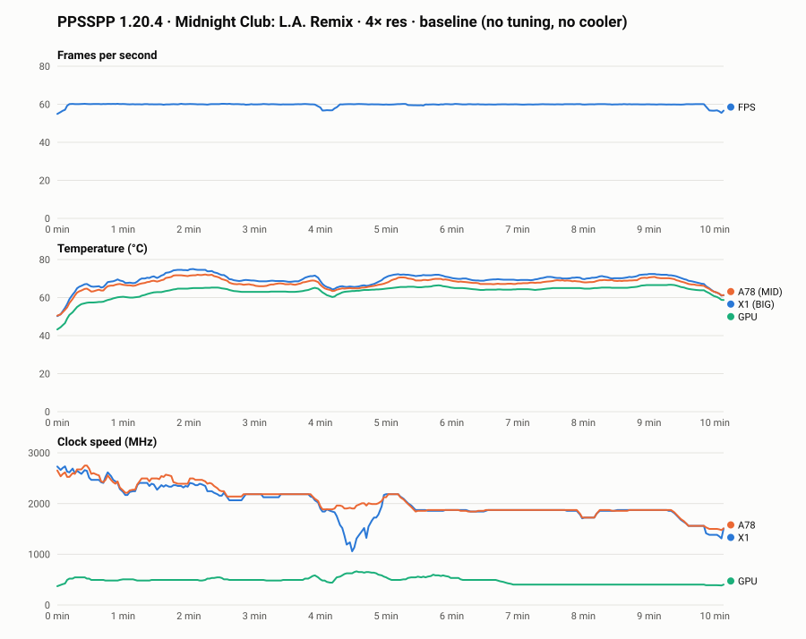

# Benchmark log

## Method

- One test game per emulator, **10 minutes of gameplay** in the same scene each run (standardised after the first run; the phone has settled into its throttled state well before then).
- Record: average FPS, 1% low FPS (if available), peak temperature, ambient temperature, charging state, cooler on/off.
- Change **one variable per run**.
- Record with [`tools/perflog.sh`](../tools/perflog.sh) and summarise with [`tools/summarize.py`](../tools/summarize.py).

### Recording a run

```bash
# once: copy the logger to the phone
adb push tools/perflog.sh /data/local/tmp/perflog.sh

# start logging (e.g. 20 min window incl. cool-down, 2 s samples), then launch the game
adb shell 'su -c "sh /data/local/tmp/perflog.sh 1200 2 /sdcard/perflog/<emulator>-<run>.csv"'

# afterwards: pull and summarise (skip the first ~60 s of menus/loading)
adb pull /sdcard/perflog/<emulator>-<run>.csv benchmarks/raw/
python3 tools/summarize.py benchmarks/raw/<emulator>-<run>.csv --skip 60
```

The logger samples **game FPS** (frames queued by the emulator's own surface, via SurfaceFlinger timestats), **display FPS** (whole-screen compositions; not a game metric), CPU cluster clocks (A55/A78/X1), GPU clock and load, the `BIG`/`MID`/`LITTLE`/`G3D`/battery temperatures, and battery state. The summary reports average FPS, 1%/5% lows, first-3-min vs last-3-min FPS (the **sustain ratio**, which is the number Phase 2 is trying to improve), and peak temperatures.

**Device state at baseline:** UN1CA 3.2.0, Floppy2100 v1.1.2 (`energy_step` governor, stock clocks: A55 2.21 GHz / A78 2.81 GHz / X1 2.91 GHz, GPU 858 MHz), display FHD+ 1080×2400 @ 120 Hz, RAM Plus off, no cooler.

## Runs

| Date | Emulator (version) | Game / scene | Settings | Tuning profile | Avg FPS | 1% low | Sustain ratio | Peak CPU °C | Peak GPU °C | Ambient °C | Cooler | Notes |
|---|---|---|---|---|---|---|---|---|---|---|---|---|
| 2026-09-28 | PPSSPP 1.20.4 | Midnight Club: L.A. Remix, continuous free-roam driving | Vulkan, 4× res, rest default | Baseline (Floppy2100 v1.1.2 stock, `energy_step`) | 59.7 | 46.6 | 100% FPS · clocks X1 75% / A78 74% / GPU 81% | 76 | 67 | n/a | No | ~10 min of gameplay (target was 15), on battery 55%→49%. [Chart](charts/ppsspp-baseline.svg) · [raw](raw/ppsspp-baseline.csv) |

### Baseline notes

**Measurement bug found (Dolphin run 0):** the first logger version counted whole-screen compositions (`service call SurfaceFlinger 1013`). With Dolphin, Android composites at up to the 120 Hz panel rate even though the game only produces ≤60 frames, so 73% of samples read >70 FPS, which is impossible for a GameCube game. The fix: read the emulator's own `SurfaceView` layer from `dumpsys SurfaceFlinger --timestats`, cumulatively, and diff it. Verified live against Dolphin's on-screen FPS (game ≈55–61 vs display ≈110–119). A second bug along the way: Android's `mksh` treats `|` as special inside `${var%pattern}`, so the layer/count separator had to change. That run's temperatures and clocks are still valid ([raw](raw/dolphin-run0-display-fps-only.csv)): CPU peaked at **80 °C**, the X1 was held at **1.56 GHz** from ~5 min in, and GPU load averaged only **34%**. Dolphin is **CPU-bound**, and when the X1 can't keep up the game runs in slow motion (below 100% emulation speed).

**PPSSPP / Midnight Club:** FPS stayed locked at 60 for the whole run, so the PSP at 4× isn't FPS-limited on this phone. The throttling shows up in the **clocks** instead: X1 and A78 were pulled from ~2.4 GHz in the first 3 minutes down to ~1.8 GHz by the end, with the CPU peaking at 76 °C. The Phase 2 goal for this emulator is therefore **the same 60 FPS at lower temperatures and power**, not more FPS.



## Before / after summary

_Filled in at the end of Phase 2._
